# RITMEX-BOT 한글 상세 설명서

> **다중 거래소 지원 암호화폐 선물 자동매매 봇**
>
> Bun 런타임 기반의 TypeScript로 작성된 전문가급 트레이딩 봇

---

## 📋 목차

1. [프로젝트 개요](#-프로젝트-개요)
2. [시스템 아키텍처](#-시스템-아키텍처)
3. [상세 작동 원리](#-상세-작동-원리)
4. [거래 전략 상세 설명](#-거래-전략-상세-설명)
5. [거래소 통합 상세](#-거래소-통합-상세)
6. [설치 및 설정](#-설치-및-설정)
7. [사용 방법](#-사용-방법)
8. [고급 기능](#-고급-기능)
9. [문제 해결](#-문제-해결)
10. [API 레퍼런스](#-api-레퍼런스)

---

## 🎯 프로젝트 개요

### 핵심 특징

**ritmex-bot**은 다음과 같은 특징을 가진 전문가급 암호화폐 선물 자동매매 시스템입니다:

- ✅ **7개 거래소 지원**: Aster, StandX, GRVT, Lighter, Backpack, Paradex, Nado
- ✅ **8가지 트레이딩 전략**: 추세추종, 마켓메이킹, 그리드, 차익거래 등
- ✅ **실시간 데이터 스트리밍**: WebSocket 기반 실시간 시세/주문/포지션 동기화
- ✅ **인터랙티브 CLI 대시보드**: Ink(React) 기반의 터미널 UI
- ✅ **포괄적 리스크 관리**: 손절매, 트레일링 스탑, 슬리피지 보호
- ✅ **다국어 지원**: 한국어/중국어/영어 인터페이스
- ✅ **프로덕션 레디**: PM2 데몬화, Telegram 알림, 자동 재연결

### 기술 스택

```
Runtime:     Bun (고성능 JavaScript/TypeScript 런타임)
Language:    TypeScript (타입 안정성)
UI:          Ink + React 19 (터미널 UI)
Crypto:      viem, ethereum-cryptography, @noble/ed25519
Exchange:    ccxt, WebSocket, 각 거래소별 공식 SDK
Trading:     자체 개발 전략 엔진
```

### 프로젝트 구조

```
ritmex-bot/
├── src/
│   ├── cli/                     # CLI 인자 파싱 & 전략 실행기
│   │   ├── args.ts              # 명령줄 인자 처리
│   │   └── strategy-runner.ts   # 전략 오케스트레이션
│   │
│   ├── core/                    # 핵심 트레이딩 로직
│   │   ├── order-coordinator.ts # 주문 조정 & 중복 제거
│   │   └── order-router.ts      # 거래소별 주문 라우팅
│   │
│   ├── exchanges/               # 거래소 어댑터 (7개)
│   │   ├── adapter.ts           # 공통 인터페이스 정의
│   │   ├── aster-adapter.ts     # Aster 구현
│   │   ├── standx/              # StandX 구현
│   │   ├── grvt/                # GRVT 구현
│   │   ├── lighter/             # Lighter 구현
│   │   ├── backpack/            # Backpack 구현
│   │   ├── paradex/             # Paradex 구현
│   │   └── nado/                # Nado 구현
│   │
│   ├── strategy/                # 전략 엔진 (8개)
│   │   ├── trend-engine.ts          # SMA30 추세추종
│   │   ├── guardian-engine.ts       # 포지션 보호
│   │   ├── maker-engine.ts          # 기본 마켓메이킹
│   │   ├── offset-maker-engine.ts   # 오프셋 마켓메이킹
│   │   ├── liquidity-maker-engine.ts # 유동성 마켓메이킹
│   │   ├── maker-points-engine.ts   # StandX 포인트 최적화
│   │   ├── grid-engine.ts           # 그리드 트레이딩
│   │   └── basis-arb-engine.ts      # 베이시스 차익거래
│   │
│   ├── ui/                      # Ink 기반 CLI 대시보드
│   │   ├── App.tsx              # 메인 앱 컴포넌트
│   │   ├── StrategyMenu.tsx     # 전략 선택 메뉴
│   │   └── dashboard/           # 전략별 대시보드
│   │
│   ├── logging/                 # 거래 로그 시스템
│   ├── notifications/           # Telegram 알림
│   ├── i18n/                    # 다국어 지원
│   └── utils/                   # 유틸리티 함수
│
├── docs/                        # 거래소별 상세 문서
├── tests/                       # 단위 테스트
├── .env.example                 # 환경 변수 템플릿
├── index.ts                     # 애플리케이션 진입점
└── package.json                 # 의존성 & 스크립트
```

---

## 🏗 시스템 아키텍처

### 전체 시스템 구조

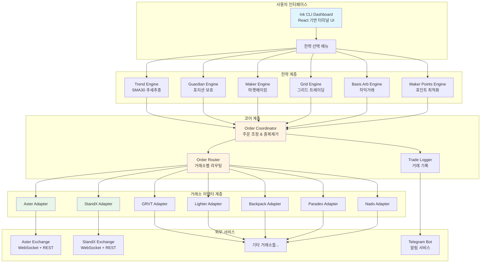

### 아키텍처 패턴

#### 1. 3계층 아키텍처 (3-Tier Architecture)

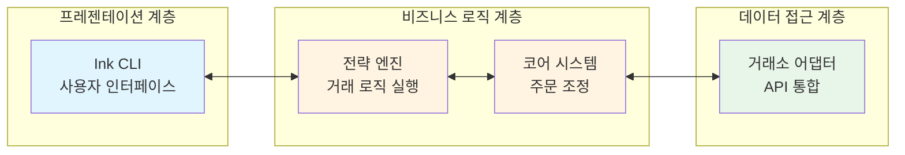

#### 2. 어댑터 패턴 (Adapter Pattern)

각 거래소는 공통 인터페이스를 구현하여 전략 엔진이 거래소 종류에 관계없이 동일한 방식으로 동작합니다.

```typescript
interface ExchangeAdapter {
  // 마켓 데이터 구독
  watchAccount(callback: AccountListener): void
  watchOrders(callback: OrderListener): void
  watchDepth(symbol: string, callback: DepthListener): void
  watchTicker(symbol: string, callback: TickerListener): void
  watchKlines(symbol: string, interval: string, callback: KlineListener): void

  // 주문 실행
  createOrder(params: CreateOrderParams): Promise<AsterOrder>
  cancelOrder(params: CancelOrderParams): Promise<void>
  cancelAllOrders(params: CancelAllParams): Promise<void>

  // 거래소 정보
  getPrecision?(): Promise<ExchangePrecision | null>
  supportsTrailingStops(): boolean
}
```

#### 3. 전략 패턴 (Strategy Pattern)

각 거래 전략은 독립적으로 구현되어 런타임에 선택 가능합니다.

```typescript
interface StrategyEngine {
  start(): void                                    // 전략 시작
  stop(): void                                     // 전략 중지
  getSnapshot(): StrategySnapshot                  // 현재 상태 조회
  on(event: string, callback: Function): void      // 이벤트 구독
  off(event: string, callback: Function): void     // 이벤트 구독 해제
}
```

---

## ⚙️ 상세 작동 원리

### 애플리케이션 시작 흐름

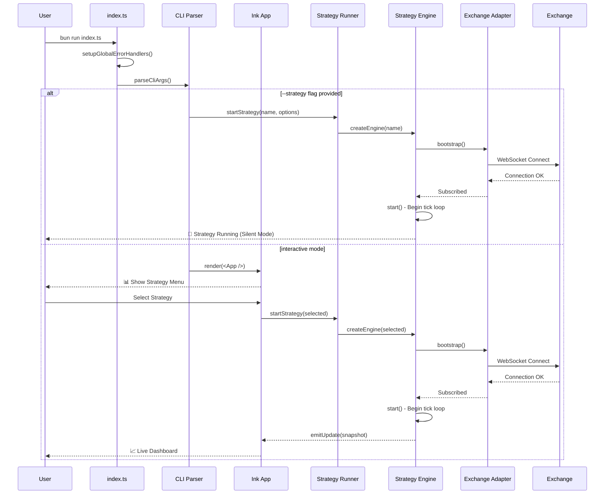

### 전략 엔진 생명주기

모든 전략 엔진은 다음과 같은 생명주기를 따릅니다:

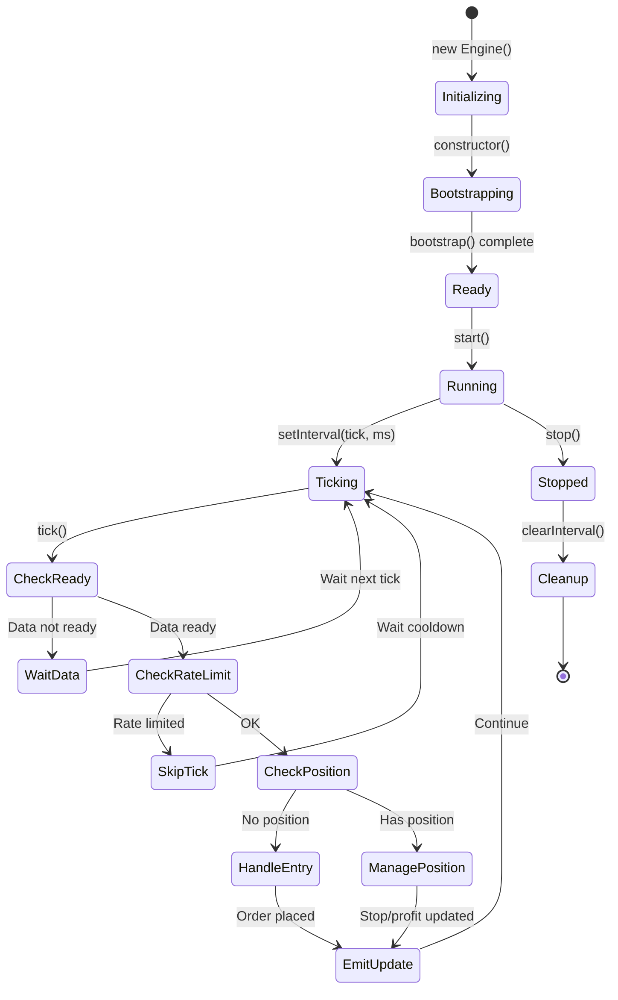

#### 1. **초기화 단계 (Initialization)**

```typescript
constructor() {
  // 1. 설정 로드
  this.config = loadConfig()

  // 2. 상태 초기화
  this.account = null
  this.orders = []
  this.depth = null
  this.ticker = null
  this.klines = []

  // 3. 로깅 시스템 초기화
  this.tradeLog = new TradeLog(maxEntries)

  // 4. 이벤트 에미터 생성
  this.events = new EventEmitter()

  // 5. 잠금 시스템 초기화
  this.locks = {}
  this.timers = {}
  this.pending = {}
}
```

#### 2. **부트스트랩 단계 (Bootstrap)**

거래소 데이터 피드 구독:

```typescript
bootstrap() {
  const adapter = getAdapter()

  // 계정 정보 구독 (잔고, 포지션)
  safeSubscribe(
    () => adapter.watchAccount(this.handleAccount.bind(this)),
    "watchAccount"
  )

  // 주문 상태 구독
  safeSubscribe(
    () => adapter.watchOrders(this.handleOrders.bind(this)),
    "watchOrders"
  )

  // 호가창 구독
  safeSubscribe(
    () => adapter.watchDepth(symbol, this.handleDepth.bind(this)),
    "watchDepth"
  )

  // 시세 구독
  safeSubscribe(
    () => adapter.watchTicker(symbol, this.handleTicker.bind(this)),
    "watchTicker"
  )

  // K라인(캔들) 구독
  safeSubscribe(
    () => adapter.watchKlines(symbol, interval, this.handleKlines.bind(this)),
    "watchKlines"
  )

  // 정밀도 자동 동기화
  this.syncPrecision()
}
```

#### 3. **메인 루프 (Main Tick Loop)**

전략의 핵심 실행 로직:

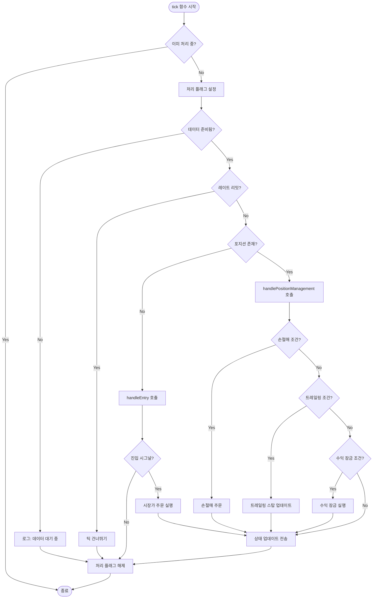

실제 코드 예시 (trend-engine.ts):

```typescript
async tick() {
  // 중복 실행 방지
  if (this.processing) return
  this.processing = true

  try {
    // 1. 데이터 준비 확인
    if (!this.isReady()) {
      this.log("info", "데이터 준비 대기 중...")
      return
    }

    // 2. 레이트 리밋 확인
    if (this.rateLimit.shouldSkip()) {
      this.log("warn", "레이트 리밋 대기 중...")
      return
    }

    const position = getPosition(this.account, this.symbol)

    // 3. 포지션 없음 → 진입 로직
    if (!position || position.contracts === 0) {
      await this.handleEntry()
    }
    // 4. 포지션 있음 → 관리 로직
    else {
      await this.handlePositionManagement(position)
    }

    // 5. UI 업데이트 전송
    this.emitUpdate()

  } catch (error) {
    this.handleError(error)
  } finally {
    this.processing = false
  }
}
```

### 주문 조정 시스템 (Order Coordinator)

중복 주문 방지 및 가격 보호를 담당하는 핵심 시스템:

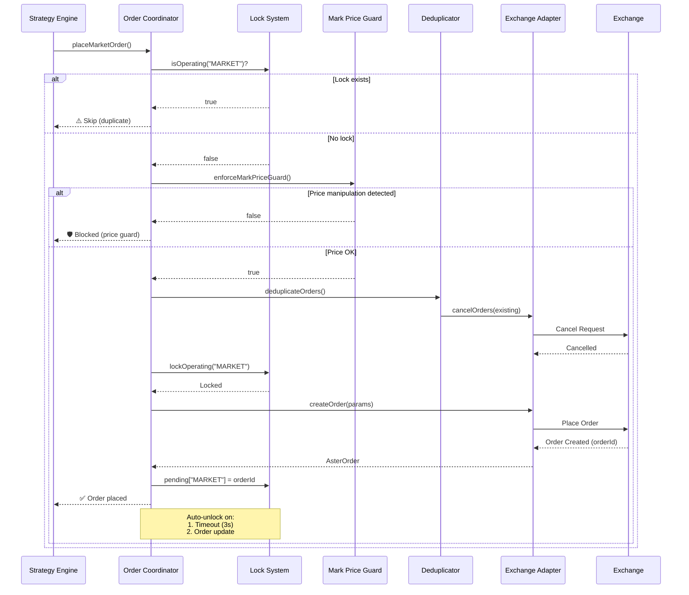

#### 주문 잠금 메커니즘

```typescript
// 잠금 타입 정의
type LockType = "MARKET" | "LIMIT" | "STOP_MARKET" | "TRAILING_STOP_MARKET"

// 잠금 확인
function isOperating(locks: Record<LockType, boolean>, type: LockType): boolean {
  return locks[type] === true
}

// 잠금 설정 (자동 해제 타이머 포함)
function lockOperating(
  locks: Record<LockType, boolean>,
  timers: Record<LockType, Timer>,
  pending: Record<LockType, string>,
  type: LockType,
  timeoutMs = 3000
) {
  locks[type] = true

  // 3초 후 자동 해제
  timers[type] = setTimeout(() => {
    unlockOperating(locks, timers, pending, type)
  }, timeoutMs)
}

// 잠금 해제
function unlockOperating(
  locks: Record<LockType, boolean>,
  timers: Record<LockType, Timer>,
  pending: Record<LockType, string>,
  type: LockType
) {
  locks[type] = false
  clearTimeout(timers[type])
  delete pending[type]
}
```

#### 마크 프라이스 가드 (Mark Price Protection)

가격 조작 공격 방지:

```typescript
function enforceMarkPriceGuard(
  orderPrice: number,
  markPrice: number,
  maxSlippagePct: number = 0.05  // 기본 5%
): boolean {
  const deviation = Math.abs(orderPrice - markPrice) / markPrice

  if (deviation > maxSlippagePct) {
    console.warn(
      `🛡️ 가격 보호: 주문가(${orderPrice})와 ` +
      `마크가(${markPrice}) 편차 ${(deviation * 100).toFixed(2)}% ` +
      `(허용: ${(maxSlippagePct * 100).toFixed(2)}%)`
    )
    return false
  }

  return true
}
```

### 데이터 흐름도

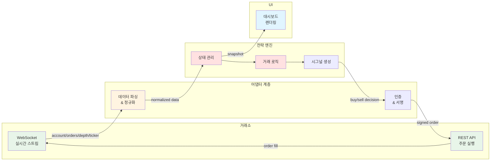

### 이벤트 기반 아키텍처

```typescript
class TrendEngine {
  private events = new EventEmitter()

  // 이벤트 발생
  emitUpdate() {
    const snapshot = this.buildSnapshot()
    this.events.emit("update", snapshot)
  }

  // 이벤트 구독 (UI에서 사용)
  on(event: "update", callback: (snapshot: Snapshot) => void) {
    this.events.on(event, callback)
  }

  // 이벤트 구독 해제
  off(event: "update", callback: Function) {
    this.events.off(event, callback)
  }
}

// UI에서 사용 예시
const engine = new TrendEngine()

engine.on("update", (snapshot) => {
  // React 상태 업데이트
  setEngineState(snapshot)
})
```

---

## 📊 거래 전략 상세 설명

### 전략 비교표

| 전략 | 유형 | 시장 조건 | 위험도 | 수익성 | 복잡도 |
|------|------|-----------|--------|--------|--------|
| **Trend** | 추세추종 | 트렌드 | 중간 | 높음 | 중간 |
| **Guardian** | 보호 | 모든 조건 | 낮음 | - | 낮음 |
| **Maker** | 마켓메이킹 | 횡보 | 낮음 | 중간 | 중간 |
| **Offset Maker** | 마켓메이킹 | 횡보 | 낮음 | 중간 | 중간 |
| **Liquidity Maker** | 마켓메이킹 | 유동성 부족 | 낮음 | 중간 | 높음 |
| **Maker Points** | 포인트 파밍 | StandX 전용 | 매우낮음 | 낮음 | 높음 |
| **Grid** | 평균회귀 | 레인지 | 중간 | 중간 | 높음 |
| **Basis Arb** | 차익거래 | 펀딩 | 낮음 | 낮음 | 중간 |

### 1. Trend 전략 (추세추종)

#### 원리

SMA30(30분 이동평균선) 돌파를 기반으로 한 추세추종 전략입니다.

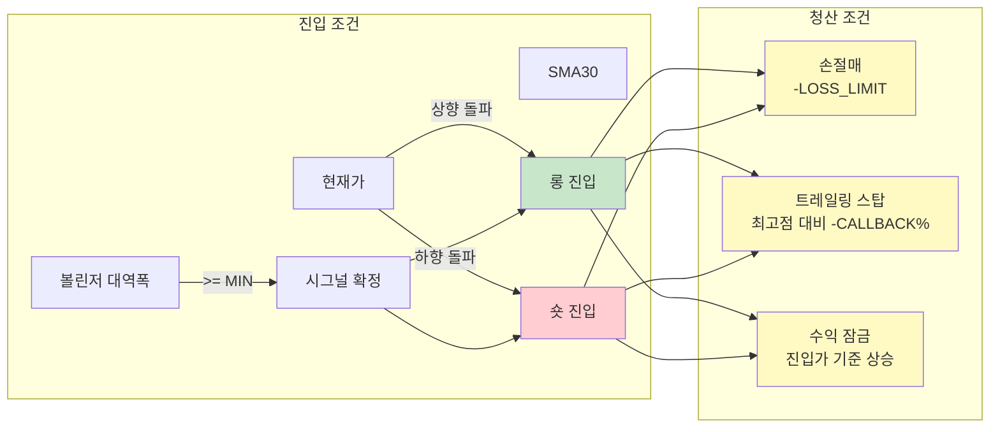

#### 상세 로직

**진입 시그널:**

```typescript
function checkEntrySignal(
  price: number,
  klines: Kline[],
  config: TrendConfig
): "LONG" | "SHORT" | null {

  // 1. SMA30 계산
  const closes = klines.slice(-30).map(k => k.close)
  const sma30 = closes.reduce((a, b) => a + b, 0) / 30

  // 2. 볼린저 대역폭 계산
  const stdDev = calculateStdDev(closes)
  const bandwidth = (stdDev * 2 * config.bollingerMultiplier) / sma30

  // 3. 대역폭 필터
  if (bandwidth < config.minBollingerBandwidth) {
    return null  // 변동성 부족
  }

  // 4. 크로스오버 확인
  const prevPrice = klines[klines.length - 2].close
  const prevAbove = prevPrice > sma30
  const nowAbove = price > sma30

  if (!prevAbove && nowAbove) {
    return "LONG"   // 상향 돌파
  }

  if (prevAbove && !nowAbove) {
    return "SHORT"  // 하향 돌파
  }

  return null
}
```

**청산 로직:**

```typescript
async handlePositionManagement(position: Position) {
  const unrealizedPnL = position.unrealizedPnl
  const side = position.side
  const entryPrice = position.entryPrice
  const currentPrice = this.ticker.last

  // 1. 손절매 확인
  if (unrealizedPnL <= -this.config.lossLimit) {
    await this.placeStopLoss(position, "손절매 발동")
    return
  }

  // 2. 트레일링 스탑 활성화
  if (unrealizedPnL >= this.config.trailingProfit) {
    // 최고 수익 기록
    this.highWaterMark = Math.max(this.highWaterMark, unrealizedPnL)

    // 콜백 비율 계산
    const drawdown = this.highWaterMark - unrealizedPnL
    const drawdownPct = drawdown / Math.abs(entryPrice * position.contracts)

    // 트레일링 스탑 발동
    if (drawdownPct >= this.config.trailingCallbackRate / 100) {
      await this.placeStopLoss(position, "트레일링 스탑 발동")
      return
    }
  }

  // 3. 수익 잠금 (베이스 손절가 상승)
  if (unrealizedPnL >= this.config.profitLockTrigger) {
    const protectionPrice = side === "LONG"
      ? entryPrice + this.config.profitLockOffset
      : entryPrice - this.config.profitLockOffset

    await this.updateStopLoss(position, protectionPrice, "수익 잠금")
  }
}
```

#### 설정 예시

```env
# Trend 전략 설정
LOSS_LIMIT=0.04                      # 손절매: -0.04 USDT
TRAILING_PROFIT=0.2                  # 트레일링 활성화: +0.2 USDT
TRAILING_CALLBACK_RATE=0.2           # 트레일링 콜백: 최고점 대비 0.2%
PROFIT_LOCK_TRIGGER_USD=0.08         # 수익 잠금 활성화: +0.08 USDT
PROFIT_LOCK_OFFSET_USD=0.04          # 손절가 이동: 진입가 + 0.04 USDT
BOLLINGER_LENGTH=20                  # 볼린저 기간: 20분
BOLLINGER_STD_MULTIPLIER=2           # 표준편차 배수: 2
MIN_BOLLINGER_BANDWIDTH=0.001        # 최소 대역폭: 0.1%
POLL_INTERVAL_MS=500                 # 틱 주기: 500ms
```

---

### 2. Guardian 전략 (포지션 보호)

#### 원리

자체적으로 포지션을 열지 않고, 기존 포지션에 대해 **강제로** 손절매/트레일링 스탑을 적용하는 보호 전략입니다.

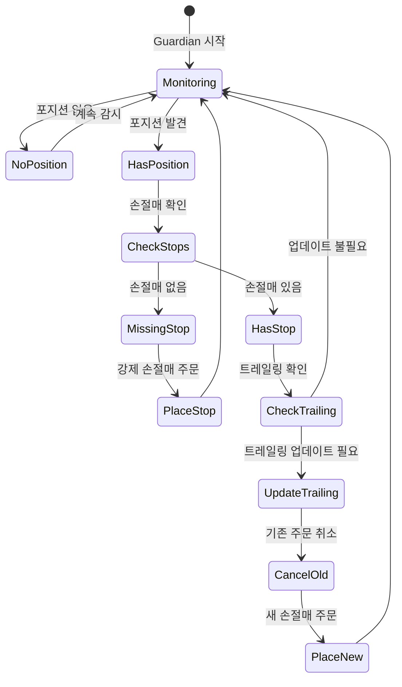

#### 사용 사례

1. **수동 거래 보호**: 수동으로 포지션을 연 후 Guardian이 자동으로 손절매 설정
2. **타 봇 보조**: 다른 거래 봇이 손절매를 지원하지 않을 때
3. **긴급 상황 대비**: 인터넷 연결 끊김 후 재연결 시 자동으로 보호 장치 복구

#### 상세 로직

```typescript
async tick() {
  const position = getPosition(this.account, this.symbol)

  // 포지션 없음 → 대기
  if (!position || position.contracts === 0) {
    this.log("info", "포지션 없음, 감시 중...")
    return
  }

  // 1. 손절매 주문 확인
  const stopOrders = this.orders.filter(o =>
    o.type === "STOP_MARKET" && o.status === "open"
  )

  if (stopOrders.length === 0) {
    // 손절매 없음 → 강제 생성
    this.log("warn", "⚠️ 손절매 없음! 긴급 생성...")
    await this.emergencyStopLoss(position)
    return
  }

  // 2. 트레일링 스탑 업데이트
  const unrealizedPnL = position.unrealizedPnl

  if (unrealizedPnL >= this.config.trailingProfit) {
    this.highWaterMark = Math.max(this.highWaterMark, unrealizedPnL)

    // 트레일링 가격 계산
    const trailingPrice = this.calculateTrailingPrice(position)
    const currentStopPrice = stopOrders[0].stopPrice

    // 가격 변동이 충분히 클 때만 업데이트
    if (Math.abs(trailingPrice - currentStopPrice) > this.priceTick * 5) {
      await this.updateTrailingStop(position, trailingPrice)
    }
  }
}
```

---

### 3. Maker 전략 (마켓메이킹)

#### 원리

매수/매도 양방향에 지정가 주문을 배치하여 스프레드를 획득하는 전략입니다.

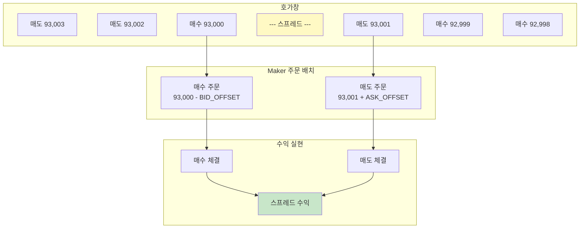

#### 상세 로직

**주문 배치:**

```typescript
async tick() {
  const position = getPosition(this.account, this.symbol)
  const depth = this.depth

  // 1. 현재 포지션 확인
  const positionContracts = position?.contracts || 0

  // 2. 손실 한도 초과 시 청산
  if (position && position.unrealizedPnl <= -this.config.makerLossLimit) {
    await this.closePosition(position, "손실 한도 도달")
    return
  }

  // 3. 양방향 주문 배치
  const topBid = depth.bids[0][0]  // 최고 매수호가
  const topAsk = depth.asks[0][0]  // 최저 매도호가

  // 매수 주문 가격 계산
  const bidPrice = roundPrice(
    topBid - this.config.bidOffset,
    this.priceTick
  )

  // 매도 주문 가격 계산
  const askPrice = roundPrice(
    topAsk + this.config.askOffset,
    this.priceTick
  )

  // 기존 주문과 비교
  const existingBid = this.orders.find(o => o.side === "BUY" && o.status === "open")
  const existingAsk = this.orders.find(o => o.side === "SELL" && o.status === "open")

  // 가격 변동이 있으면 주문 갱신
  if (!existingBid || existingBid.price !== bidPrice) {
    if (existingBid) await this.cancelOrder(existingBid)

    // 포지션이 양수(롱)가 아닐 때만 매수 주문
    if (positionContracts <= 0) {
      await this.placeLimitOrder("BUY", bidPrice, this.config.orderSize)
    }
  }

  if (!existingAsk || existingAsk.price !== askPrice) {
    if (existingAsk) await this.cancelOrder(existingAsk)

    // 포지션이 음수(숏)가 아닐 때만 매도 주문
    if (positionContracts >= 0) {
      await this.placeLimitOrder("SELL", askPrice, this.config.orderSize)
    }
  }
}
```

**리스크 관리:**

```typescript
// 포지션 크기 제한
const MAX_POSITION = this.config.orderSize * 3

if (Math.abs(positionContracts) >= MAX_POSITION) {
  // 한쪽 방향만 주문 (리스크 감소)
  if (positionContracts > 0) {
    // 롱 포지션 → 매도 주문만
    await this.placeLimitOrder("SELL", askPrice, this.config.orderSize)
  } else {
    // 숏 포지션 → 매수 주문만
    await this.placeLimitOrder("BUY", bidPrice, this.config.orderSize)
  }
}
```

#### 설정 예시

```env
# Maker 전략 설정
MAKER_LOSS_LIMIT=0.05                # 손실 한도: -0.05 USDT
MAKER_BID_OFFSET=0                   # 매수 오프셋: 0 USDT (최고호가)
MAKER_ASK_OFFSET=0                   # 매도 오프셋: 0 USDT (최저호가)
MAKER_REFRESH_INTERVAL_MS=500        # 갱신 주기: 500ms
MAKER_MAX_CLOSE_SLIPPAGE_PCT=0.05    # 청산 슬리피지: 5%
TRADE_AMOUNT=0.001                   # 주문 크기: 0.001 BTC
```

---

### 4. Grid 전략 (그리드 트레이딩)

#### 원리

가격 범위를 여러 구간(그리드)으로 나누고, 각 레벨에서 매수/매도를 반복하여 변동성에서 수익을 얻는 전략입니다.

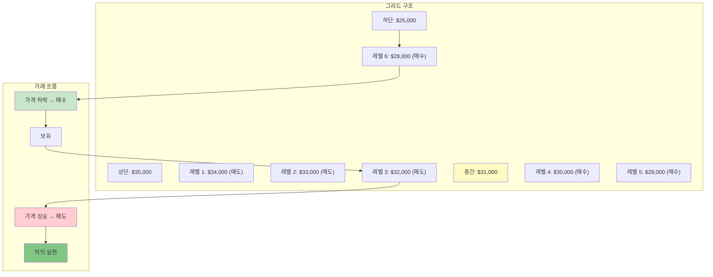

#### 상세 로직

**그리드 레벨 계산:**

```typescript
function calculateGridLevels(
  lowerPrice: number,
  upperPrice: number,
  numLevels: number
): number[] {
  const levels: number[] = []
  const ratio = Math.pow(upperPrice / lowerPrice, 1 / (numLevels - 1))

  for (let i = 0; i < numLevels; i++) {
    const level = lowerPrice * Math.pow(ratio, i)
    levels.push(level)
  }

  return levels
}

// 예시: 25000 ~ 35000, 10 레벨
const levels = calculateGridLevels(25000, 35000, 10)
// [25000, 26169, 27419, 28754, 30181, 31705, 33333, 35072, 36929, 35000]
```

**주문 배치 로직:**

```typescript
async tick() {
  const currentPrice = this.ticker.last
  const position = getPosition(this.account, this.symbol)

  // 1. 범위 이탈 확인
  if (currentPrice < this.lowerPrice * (1 - this.config.stopLossPct)) {
    await this.handleStopLoss("하단 이탈")
    return
  }

  if (currentPrice > this.upperPrice * (1 + this.config.stopLossPct)) {
    await this.handleStopLoss("상단 이탈")
    return
  }

  // 2. 현재 가격 기준으로 주문 배치
  for (const level of this.gridLevels) {
    // 현재가보다 낮은 레벨 → 매수 주문 (ENTRY)
    if (level < currentPrice) {
      const existingOrder = this.findOrder(level, "BUY")

      if (!existingOrder && this.canPlaceBuyOrder()) {
        await this.placeLimitOrder("BUY", level, this.config.orderSize, {
          intent: "ENTRY",
          sourceLevel: level,
          targetLevel: this.findTargetSellLevel(level)
        })
      }
    }

    // 현재가보다 높은 레벨 → 매도 주문
    if (level > currentPrice) {
      // 매도는 매수 체결 후에만 배치 (EXIT)
      const buyFilled = this.findFilledBuyOrder(level)

      if (buyFilled && !this.findOrder(level, "SELL")) {
        await this.placeLimitOrder("SELL", level, this.config.orderSize, {
          intent: "EXIT",
          sourceLevel: buyFilled.sourceLevel,
          targetLevel: level
        })
      }
    }
  }

  // 3. 포지션 크기 제한
  if (Math.abs(position.contracts) >= this.config.maxPositionSize) {
    this.log("warn", "최대 포지션 도달, 신규 진입 중단")
    await this.cancelEntryOrders()
  }
}
```

**그리드 재시작 로직:**

```typescript
// 가격이 범위를 벗어났다가 다시 들어올 때
if (this.stopped && this.config.autoRestartEnabled) {
  const backInRange =
    currentPrice >= this.lowerPrice * (1 + this.config.restartTriggerPct) &&
    currentPrice <= this.upperPrice * (1 - this.config.restartTriggerPct)

  if (backInRange) {
    this.log("info", "✅ 가격 범위 재진입, 그리드 재시작")
    await this.restart()
  }
}
```

#### 설정 예시

```env
# Grid 전략 설정
GRID_LOWER_PRICE=25000               # 하단: $25,000
GRID_UPPER_PRICE=35000               # 상단: $35,000
GRID_LEVELS=10                       # 레벨 수: 10개
GRID_ORDER_SIZE=0.001                # 주문 크기: 0.001 BTC
GRID_MAX_POSITION_SIZE=0.01          # 최대 포지션: 0.01 BTC
GRID_REFRESH_INTERVAL_MS=1000        # 갱신 주기: 1000ms
GRID_DIRECTION=both                  # 방향: both/long/short
GRID_STOP_LOSS_PCT=0.01              # 손절매: 범위 ±1%
GRID_RESTART_TRIGGER_PCT=0.01        # 재시작: 범위 내 1%
GRID_AUTO_RESTART_ENABLED=true       # 자동 재시작: 활성화
```

---

### 5. Maker Points 전략 (StandX 포인트 최적화)

#### 원리

StandX 거래소의 포인트 시스템을 최적화하기 위해 다층 호가를 배치하는 전략입니다.

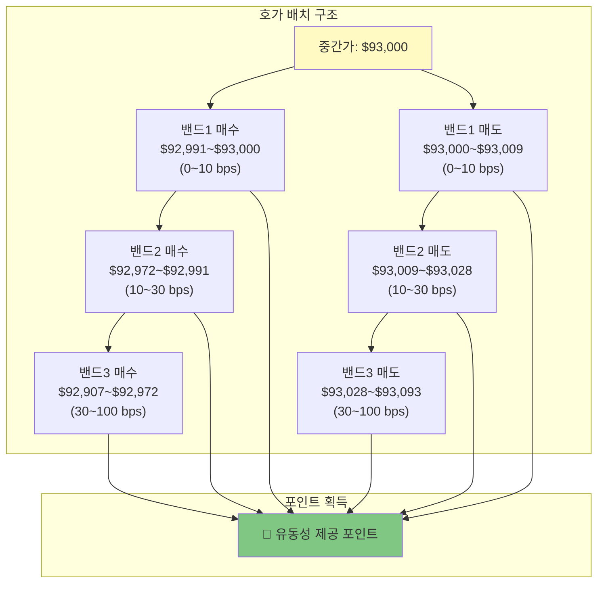

#### 밴드 설정

```typescript
const BANDS = [
  { min: 0, max: 10, count: 3 },      // 0~10 bps: 3개 주문
  { min: 10, max: 30, count: 2 },     // 10~30 bps: 2개 주문
  { min: 30, max: 100, count: 1 }     // 30~100 bps: 1개 주문
]

function calculateBandPrices(midPrice: number, side: "BUY" | "SELL") {
  const prices: number[] = []

  for (const band of BANDS) {
    for (let i = 0; i < band.count; i++) {
      // 밴드 내 균등 분포
      const bps = band.min + (band.max - band.min) * (i / band.count)
      const offset = midPrice * (bps / 10000)

      const price = side === "BUY"
        ? midPrice - offset
        : midPrice + offset

      prices.push(roundPrice(price, PRICE_TICK))
    }
  }

  return prices
}
```

---

### 6. Basis Arb 전략 (베이시스 차익거래)

#### 원리

선물 가격과 현물 가격의 차이(베이시스)를 이용한 차익거래 전략입니다.

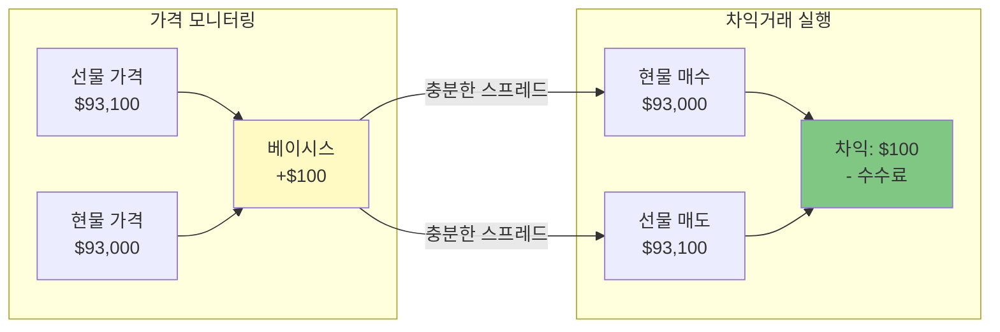

#### 수익성 계산

```typescript
function calculateProfitability(
  futuresPrice: number,
  spotPrice: number,
  fees: { maker: number, taker: number }
): number {
  // 베이시스 (선물 - 현물)
  const basis = futuresPrice - spotPrice

  // 수수료 (양방향)
  const totalFees = spotPrice * fees.taker + futuresPrice * fees.maker

  // 순수익
  const netProfit = basis - totalFees

  return netProfit
}

// 예시
const profit = calculateProfitability(
  93100,  // 선물가
  93000,  // 현물가
  { maker: 0.0002, taker: 0.0005 }  // 수수료
)
// profit = 100 - (93000*0.0005 + 93100*0.0002) = 100 - 65.12 = 34.88 USDT
```

---

## 🔌 거래소 통합 상세

### 거래소 어댑터 구조

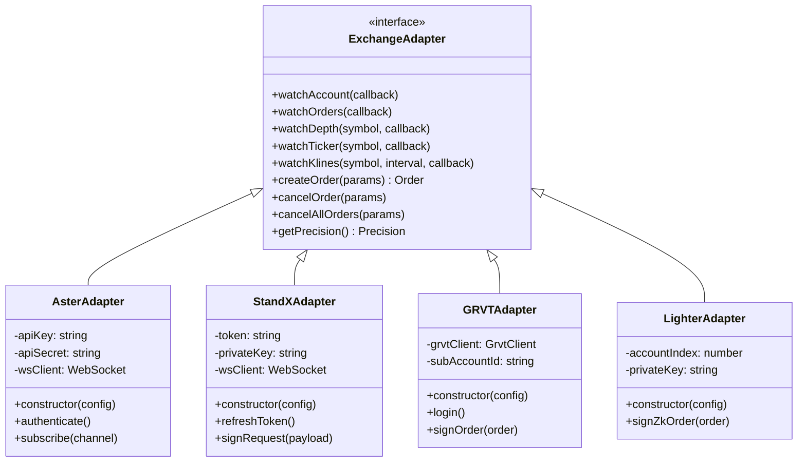

### 1. Aster 거래소

#### 인증 방식

```typescript
// HMAC SHA256 서명
function signRequest(
  method: string,
  path: string,
  body: string,
  timestamp: number,
  apiSecret: string
): string {
  const message = `${timestamp}${method}${path}${body}`
  const signature = crypto
    .createHmac("sha256", apiSecret)
    .update(message)
    .digest("hex")

  return signature
}

// API 요청 예시
async function createOrder(params: OrderParams) {
  const timestamp = Date.now()
  const body = JSON.stringify(params)
  const signature = signRequest("POST", "/api/v1/order", body, timestamp, apiSecret)

  const response = await fetch("https://api.aster.com/api/v1/order", {
    method: "POST",
    headers: {
      "X-API-KEY": apiKey,
      "X-TIMESTAMP": timestamp.toString(),
      "X-SIGNATURE": signature,
      "Content-Type": "application/json"
    },
    body
  })

  return response.json()
}
```

#### WebSocket 구독

```typescript
// WebSocket 연결
const ws = new WebSocket("wss://api.aster.com/ws")

// 인증
ws.send(JSON.stringify({
  op: "auth",
  args: [apiKey, timestamp, signature]
}))

// 계정 정보 구독
ws.send(JSON.stringify({
  op: "subscribe",
  args: ["account"]
}))

// 주문 상태 구독
ws.send(JSON.stringify({
  op: "subscribe",
  args: ["orders"]
}))

// 호가창 구독
ws.send(JSON.stringify({
  op: "subscribe",
  args: [`depth.BTCUSDT`]
}))
```

---

### 2. StandX 거래소

#### JWT 인증

```typescript
// 1. 토큰 획득 (브라우저에서 수동 추출)
const token = process.env.STANDX_TOKEN

// 2. API 요청 시 Authorization 헤더 사용
async function createOrder(params: OrderParams) {
  const response = await fetch("https://perps.standx.com/api/v1/order", {
    method: "POST",
    headers: {
      "Authorization": `Bearer ${token}`,
      "Content-Type": "application/json"
    },
    body: JSON.stringify(params)
  })

  return response.json()
}
```

#### Ed25519 요청 서명 (선택사항)

```typescript
import * as ed25519 from "@noble/ed25519"

async function signRequest(
  payload: any,
  privateKey: string
): Promise<string> {
  // 페이로드를 JSON 문자열로 변환
  const message = JSON.stringify(payload)

  // UTF-8 인코딩
  const messageBytes = new TextEncoder().encode(message)

  // Ed25519 서명 생성
  const privateKeyBytes = Buffer.from(privateKey, "hex")
  const signature = await ed25519.sign(messageBytes, privateKeyBytes)

  // Hex 인코딩
  return Buffer.from(signature).toString("hex")
}

// 서명된 요청
const payload = {
  symbol: "BTC-USD",
  side: "BUY",
  type: "LIMIT",
  price: "93000",
  quantity: "0.001"
}

const signature = await signRequest(payload, privateKey)

await fetch("https://perps.standx.com/api/v1/order", {
  method: "POST",
  headers: {
    "Authorization": `Bearer ${token}`,
    "X-Signature": signature,
    "Content-Type": "application/json"
  },
  body: JSON.stringify(payload)
})
```

---

### 3. GRVT 거래소

#### EIP-712 주문 서명

```typescript
import { signTypedData } from "viem"

// EIP-712 도메인
const domain = {
  name: "GRVT Exchange",
  version: "1",
  chainId: 1,
  verifyingContract: "0x..."
}

// 주문 타입 정의
const types = {
  Order: [
    { name: "subAccountId", type: "string" },
    { name: "instrument", type: "string" },
    { name: "side", type: "string" },
    { name: "orderType", type: "string" },
    { name: "price", type: "string" },
    { name: "quantity", type: "string" },
    { name: "nonce", type: "uint256" },
    { name: "expiry", type: "uint256" }
  ]
}

// 주문 데이터
const order = {
  subAccountId: "sub_123",
  instrument: "BTC_USDT_Perp",
  side: "BUY",
  orderType: "LIMIT",
  price: "93000",
  quantity: "0.001",
  nonce: Date.now(),
  expiry: Date.now() + 86400000  // 24시간
}

// 서명 생성
const signature = await signTypedData({
  domain,
  types,
  primaryType: "Order",
  message: order,
  privateKey: "0x..."
})

// API 요청
await grvtClient.createOrder({
  ...order,
  signature
})
```

---

### 4. Lighter 거래소

#### zkSync 주문 서명

```typescript
import { Wallet } from "zksync-ethers"

// 주문 해시 생성
function createOrderHash(order: Order): string {
  const packed = ethers.utils.solidityPack(
    ["uint64", "uint64", "uint64", "uint64", "uint8", "uint8"],
    [
      order.accountIndex,
      order.marketId,
      order.price,
      order.size,
      order.side,      // 0 = BUY, 1 = SELL
      order.orderType  // 0 = LIMIT, 1 = MARKET
    ]
  )

  return ethers.utils.keccak256(packed)
}

// zkSync 서명
async function signOrder(order: Order, privateKey: string) {
  const wallet = new Wallet(privateKey)
  const orderHash = createOrderHash(order)

  const signature = await wallet.signMessage(
    ethers.utils.arrayify(orderHash)
  )

  return signature
}

// API 요청
const order = {
  accountIndex: 12345,
  marketId: 1,
  price: BigInt(93000 * 1e3),  // 3 decimals
  size: BigInt(1 * 1e3),       // 3 decimals (0.001 BTC)
  side: 0,
  orderType: 0
}

const signature = await signOrder(order, privateKey)

await fetch("https://testnet.zklighter.elliot.ai/api/v1/order", {
  method: "POST",
  body: JSON.stringify({ ...order, signature })
})
```

---

### 5. Nado 거래소

#### 공식 SDK 사용

```typescript
import { Gateway, AuthSigner } from "@nadohq/client"

// 1. Signer 초기화
const signer = new AuthSigner(NADO_SIGNER_PRIVATE_KEY)

// 2. Gateway 연결
const gateway = new Gateway({
  env: "inkMainnet",  // or "inkTestnet"
  signer,
  subaccountOwner: NADO_SUBACCOUNT_OWNER,
  subaccountName: "default"
})

await gateway.connect()

// 3. 주문 생성
const order = await gateway.placeOrder({
  product: "BTC-PERP",
  side: "BUY",
  orderType: "LIMIT",
  price: "93000",
  size: "0.001",
  timeInForce: "GTC"
})

// 4. WebSocket 구독
gateway.on("account", (account) => {
  console.log("계정 업데이트:", account)
})

gateway.on("orders", (orders) => {
  console.log("주문 업데이트:", orders)
})

gateway.on("fills", (fills) => {
  console.log("체결 정보:", fills)
})
```

---

## 🚀 설치 및 설정

### 시스템 요구사항

- **Bun**: ≥ 1.2 버전
- **운영체제**: macOS, Linux, Windows (WSL 권장)
- **메모리**: 최소 512MB RAM
- **디스크**: 최소 100MB 여유 공간

### 설치 방법

#### 방법 1: 자동 설치 스크립트 (권장)

```bash
curl -fsSL https://github.com/discountry/ritmex-bot/raw/refs/heads/main/setup.sh | bash
```

스크립트가 자동으로:
1. Bun 설치
2. 프로젝트 클론
3. 의존성 설치
4. `.env` 파일 생성
5. API 키 입력 받기
6. 봇 실행

#### 방법 2: 수동 설치

**1단계: Bun 설치**

```bash
# macOS/Linux
curl -fsSL https://bun.sh/install | bash

# Windows (PowerShell)
powershell -c "irm bun.sh/install.ps1 | iex"
```

설치 후 터미널 재시작:

```bash
# 버전 확인
bun -v
```

**2단계: 프로젝트 클론**

```bash
git clone https://github.com/discountry/ritmex-bot.git
cd ritmex-bot
```

**3단계: 의존성 설치**

```bash
bun install
```

**4단계: 환경 변수 설정**

```bash
cp .env.example .env
```

`.env` 파일을 편집하여 설정:

```env
# 1. 거래소 선택
EXCHANGE=aster

# 2. Aster API 키 (Aster 사용 시)
ASTER_API_KEY=your_api_key_here
ASTER_API_SECRET=your_api_secret_here

# 3. 거래 설정
TRADE_SYMBOL=BTCUSDT
TRADE_AMOUNT=0.001

# 4. 리스크 관리
LOSS_LIMIT=0.04
TRAILING_PROFIT=0.2
TRAILING_CALLBACK_RATE=0.2

# 5. 정밀도
PRICE_TICK=0.1
QTY_STEP=0.001
```

**5단계: 실행**

```bash
bun run index.ts
```

---

### 거래소별 설정 가이드

#### Aster 설정

1. [Aster 거래소](https://www.asterdex.com/) 가입
2. API 키 생성:
   - 설정 → API 관리 → 새 API 키 생성
   - 권한: **읽기**, **거래** 체크
   - IP 화이트리스트 설정 (권장)
3. `.env` 파일에 입력:
   ```env
   EXCHANGE=aster
   ASTER_API_KEY=your_api_key
   ASTER_API_SECRET=your_api_secret
   ```

#### StandX 설정

1. [StandX 토큰 추출 페이지](https://standx.ritmex.one/) 접속
2. 지갑 연결 및 로그인
3. "로그인 정보 내보내기" 클릭
4. 토큰 및 대리 지갑 키 복사
5. `.env` 파일에 입력:
   ```env
   EXCHANGE=standx
   STANDX_TOKEN=eyJhbGc...
   STANDX_REQUEST_PRIVATE_KEY=abc123...
   STANDX_SYMBOL=BTC-USD
   ```

#### GRVT 설정

1. [GRVT 거래소](https://grvt.io/) 가입
2. API 키 생성 및 서브계정 ID 확인
3. `.env` 파일에 입력:
   ```env
   EXCHANGE=grvt
   GRVT_API_KEY=your_api_key
   GRVT_API_SECRET=your_api_secret
   GRVT_SUB_ACCOUNT_ID=sub_123
   GRVT_INSTRUMENT=BTC_USDT_Perp
   GRVT_ENV=prod
   ```

#### Lighter 설정

1. [Lighter 거래소](https://app.lighter.xyz/) 가입
2. F12 개발자 도구로 네트워크 탭 확인
3. API 요청에서 `accountIndex` 확인
4. 지갑 개인키 준비 (40바이트 hex)
5. `.env` 파일에 입력:
   ```env
   EXCHANGE=lighter
   LIGHTER_ACCOUNT_INDEX=12345
   LIGHTER_API_PRIVATE_KEY=0xabc...
   LIGHTER_ENV=testnet
   ```

#### Nado 설정

1. [Nado 거래소](https://app.nado.xyz/) 가입
2. F12 → Application → Local Storage
3. `nado.userSettings` → `privateKey` 복사
4. `.env` 파일에 입력:
   ```env
   EXCHANGE=nado
   NADO_ENV=inkMainnet
   NADO_SYMBOL=BTC-PERP
   NADO_SIGNER_PRIVATE_KEY=0xabc...
   NADO_SUBACCOUNT_OWNER=0xYourAddress...
   ```

---

## 📱 사용 방법

### 인터랙티브 모드

기본 실행 시 메뉴가 표시됩니다:

```bash
bun run index.ts
```

```
┌─────────────────────────────────────┐
│     RITMEX-BOT 전략 선택 메뉴       │
├─────────────────────────────────────┤
│  ▸ Trend      - SMA30 추세추종      │
│    Guardian   - 포지션 보호         │
│    Maker      - 마켓메이킹          │
│    Grid       - 그리드 트레이딩     │
│    Basis Arb  - 베이시스 차익거래   │
│                                      │
│  ↑↓: 선택  Enter: 실행  Ctrl+C: 종료│
└─────────────────────────────────────┘
```

**키 조작:**
- `↑` / `↓`: 전략 선택
- `Enter`: 전략 시작
- `Esc`: 메뉴로 돌아가기
- `Ctrl+C`: 프로그램 종료

### 대시보드 화면

전략 실행 중 실시간 정보가 표시됩니다:

```
┌─────────────────────────────────────────────────────────────┐
│ RITMEX-BOT - Trend 전략                    Aster | BTCUSDT   │
├─────────────────────────────────────────────────────────────┤
│ 📊 시장 정보                                                 │
│   현재가: 93,145.2 USDT                                      │
│   SMA30:  92,980.5 USDT  ↗ 상승추세                         │
│   변동성: 0.0025 (충분)                                      │
│                                                              │
│ 💼 포지션                                                    │
│   방향:   LONG                                               │
│   크기:   0.001 BTC                                          │
│   진입가: 92,950.0 USDT                                      │
│   현재PnL: +0.195 USDT (+0.21%)                              │
│                                                              │
│ 🎯 리스크 관리                                               │
│   손절매:  92,900.0 USDT (-0.050 USDT)                      │
│   트레일링: 활성화 (최고점: +0.210 USDT)                     │
│   수익잠금: 대기중                                           │
│                                                              │
│ 📋 최근 거래 로그                                            │
│   [2026-01-14 10:23:15] 시장가 매수: 0.001 BTC @ 92,950    │
│   [2026-01-14 10:23:16] 손절매 주문: 92,900                │
│   [2026-01-14 10:25:30] 트레일링 스탑 활성화                │
│                                                              │
│ Esc: 메뉴  Ctrl+C: 종료                                      │
└─────────────────────────────────────────────────────────────┘
```

### 사일런트 모드 (로그 출력)

서버나 백그라운드 실행 시 사용:

```bash
# Trend 전략 사일런트 모드
bun run index.ts --strategy trend --silent

# Maker 전략 사일런트 모드
bun run index.ts --strategy maker --silent

# 거래소 지정
bun run index.ts --exchange standx --strategy maker-points --silent
```

출력 예시:

```
[2026-01-14 10:23:15] [INFO] Trend 전략 시작: BTCUSDT on Aster
[2026-01-14 10:23:16] [INFO] WebSocket 연결 성공
[2026-01-14 10:23:17] [INFO] 데이터 준비 완료
[2026-01-14 10:23:18] [ORDER] 시장가 매수: 0.001 BTC @ 92,950 USDT
[2026-01-14 10:23:19] [ORDER] 손절매 주문 설정: 92,900 USDT
[2026-01-14 10:25:30] [INFO] 트레일링 스탑 활성화: +0.210 USDT
[2026-01-14 10:27:45] [CLOSE] 트레일링 스탑 청산: +0.185 USDT
```

### PM2 데몬 모드

지속적인 백그라운드 실행:

```bash
# PM2 설치
bun add -g pm2

# Trend 전략 시작
bun run pm2:start:trend

# Maker 전략 시작
bun run pm2:start:maker

# 프로세스 목록 확인
pm2 list

# 로그 확인
pm2 logs ritmex-trend

# 프로세스 중지
pm2 stop ritmex-trend

# 프로세스 삭제
pm2 delete ritmex-trend

# 설정 저장 (재부팅 후 자동 시작)
pm2 save
pm2 startup
```

---

## 🎓 고급 기능

### Telegram 알림 설정

중요한 거래 이벤트를 Telegram으로 수신:

**1단계: Telegram 봇 생성**

1. Telegram에서 [@BotFather](https://t.me/BotFather) 검색
2. `/newbot` 명령어 입력
3. 봇 이름 및 사용자명 설정
4. API 토큰 복사 (예: `123456789:ABCdefGHIjklMNOpqrsTUVwxyz`)

**2단계: Chat ID 확인**

1. [@userinfobot](https://t.me/userinfobot) 검색
2. `/start` 입력
3. Chat ID 복사 (예: `987654321`)

**3단계: 환경 변수 설정**

```env
TELEGRAM_BOT_TOKEN=123456789:ABCdefGHIjklMNOpqrsTUVwxyz
TELEGRAM_CHAT_ID=987654321
TELEGRAM_ACCOUNT_LABEL=메인계정
```

**알림 예시:**

```
🤖 RITMEX-BOT [메인계정]

📈 주문 체결
거래소: Aster
심볼: BTCUSDT
방향: 매수 (LONG)
수량: 0.001 BTC
가격: 92,950 USDT
시간: 2026-01-14 10:23:18

───────────────────
💰 현재 포지션
크기: 0.001 BTC
진입가: 92,950 USDT
미실현 손익: +0.195 USDT
```

### 다중 인스턴스 실행

여러 전략을 동시에 실행:

```bash
# 터미널 1: Trend 전략
bun run pm2:start:trend

# 터미널 2: Maker 전략
bun run pm2:start:maker

# 터미널 3: Grid 전략
pm2 start bun --name ritmex-grid -- run index.ts --strategy grid --silent
```

각 인스턴스는 독립적으로 동작하며, `.env` 파일을 공유합니다. 다른 설정이 필요한 경우:

```bash
# 별도 디렉토리로 복사
cp -r ritmex-bot ritmex-bot-maker
cd ritmex-bot-maker

# 다른 설정 적용
vim .env

# 실행
bun run pm2:start:maker
```

### 정밀도 자동 동기화

거래소의 가격/수량 필터를 자동으로 가져옵니다:

```typescript
async syncPrecision() {
  const adapter = getAdapter()

  if (adapter.getPrecision) {
    const precision = await adapter.getPrecision()

    if (precision) {
      // 환경 변수보다 거래소 데이터 우선
      this.priceTick = precision.priceTick || this.config.priceTick
      this.qtyStep = precision.qtyStep || this.config.qtyStep

      this.log("info", `정밀도 동기화: tick=${this.priceTick}, step=${this.qtyStep}`)
    }
  }
}
```

### 레이트 리밋 제어

거래소 API 제한을 자동으로 관리:

```typescript
class RateLimitController {
  private lastRateLimitTime = 0
  private cooldownMs = 60000  // 1분

  registerRateLimit() {
    this.lastRateLimitTime = Date.now()
  }

  shouldSkip(): boolean {
    if (this.lastRateLimitTime === 0) return false

    const elapsed = Date.now() - this.lastRateLimitTime
    return elapsed < this.cooldownMs
  }

  getRemainingCooldown(): number {
    const elapsed = Date.now() - this.lastRateLimitTime
    return Math.max(0, this.cooldownMs - elapsed)
  }
}
```

### 사용자 정의 전략 개발

새로운 전략을 추가하는 방법:

**1단계: 전략 파일 생성**

`src/strategy/my-strategy-engine.ts`:

```typescript
import { EventEmitter } from "events"
import { TradeLog } from "../logging/trade-log"
import type { ExchangeAdapter } from "../exchanges/adapter"

export class MyStrategyEngine {
  private events = new EventEmitter()
  private tradeLog = new TradeLog(200)
  private timer: Timer | null = null
  private processing = false

  // 데이터 상태
  private account: Account | null = null
  private orders: AsterOrder[] = []
  private ticker: Ticker | null = null

  constructor() {
    this.bootstrap()
  }

  // 데이터 피드 구독
  bootstrap() {
    const adapter = getAdapter()

    adapter.watchAccount((account) => {
      this.account = account
    })

    adapter.watchOrders((orders) => {
      this.orders = orders
    })

    adapter.watchTicker(symbol, (ticker) => {
      this.ticker = ticker
    })
  }

  // 전략 시작
  start() {
    this.timer = setInterval(() => {
      void this.tick()
    }, 1000)  // 1초마다 실행
  }

  // 메인 로직
  async tick() {
    if (this.processing) return
    this.processing = true

    try {
      // 전략 로직 구현
      const signal = this.calculateSignal()

      if (signal === "BUY") {
        await this.placeBuyOrder()
      } else if (signal === "SELL") {
        await this.placeSellOrder()
      }

      this.emitUpdate()
    } finally {
      this.processing = false
    }
  }

  // 시그널 계산
  calculateSignal(): "BUY" | "SELL" | "HOLD" {
    // 여기에 로직 구현
    return "HOLD"
  }

  // 전략 중지
  stop() {
    if (this.timer) {
      clearInterval(this.timer)
      this.timer = null
    }
  }

  // 상태 조회
  getSnapshot() {
    return {
      account: this.account,
      orders: this.orders,
      ticker: this.ticker,
      log: this.tradeLog.all()
    }
  }

  // 이벤트
  on(event: "update", callback: Function) {
    this.events.on(event, callback)
  }

  off(event: "update", callback: Function) {
    this.events.off(event, callback)
  }

  private emitUpdate() {
    this.events.emit("update", this.getSnapshot())
  }
}
```

**2단계: 전략 등록**

`src/cli/strategy-runner.ts`에 추가:

```typescript
import { MyStrategyEngine } from "../strategy/my-strategy-engine"

const STRATEGY_MAP = {
  // ... 기존 전략들
  "my-strategy": () => new MyStrategyEngine()
}
```

**3단계: 실행**

```bash
bun run index.ts --strategy my-strategy --silent
```

---

## 🔧 문제 해결

### 일반적인 문제

#### 1. "Bun not found"

**증상:**
```bash
bun: command not found
```

**해결:**
```bash
# Bun 재설치
curl -fsSL https://bun.sh/install | bash

# 쉘 설정 새로고침
source ~/.bashrc  # 또는 ~/.zshrc
```

#### 2. "환경 변수를 읽을 수 없습니다"

**증상:**
```
Error: ASTER_API_KEY is not defined
```

**해결:**
```bash
# .env 파일 위치 확인
ls -la .env

# 권한 확인
chmod 600 .env

# 내용 확인 (민감 정보 주의)
cat .env | grep ASTER_API_KEY
```

#### 3. "정밀도 오류 (Precision error)"

**증상:**
```
Error: Precision error - price 93145.234 does not match tick size 0.1
```

**해결:**

`.env` 파일에서 정밀도 수정:

```env
# 가격 정밀도 (소수점 자리수)
PRICE_TICK=0.1     # BTC: 0.1, ETH: 0.01

# 수량 정밀도
QTY_STEP=0.001     # BTC: 0.001, ETH: 0.01
```

또는 자동 동기화 활성화:

```typescript
// 전략 생성자에서
await this.syncPrecision()
```

#### 4. "WebSocket 연결 실패"

**증상:**
```
WebSocket connection failed: ETIMEDOUT
```

**해결:**

1. 네트워크 연결 확인:
   ```bash
   ping api.asterdex.com
   ```

2. 방화벽 설정 확인

3. VPN 사용 시 다른 서버로 변경

4. 재연결 로직 확인:
   ```typescript
   // 자동 재연결 (10초 후)
   setTimeout(() => {
     adapter.reconnect()
   }, 10000)
   ```

#### 5. "API 권한 오류"

**증상:**
```
Error: API key does not have permission for this operation
```

**해결:**

거래소 API 설정에서 권한 확인:
- ✅ 읽기 (계정 정보)
- ✅ 거래 (주문 생성/취소)
- ❌ 출금 (불필요, 보안상 권장하지 않음)

#### 6. "레이트 리밋 초과"

**증상:**
```
Error: Rate limit exceeded (429)
```

**해결:**

1. 틱 주기 증가:
   ```env
   POLL_INTERVAL_MS=1000  # 500ms → 1000ms
   ```

2. 레이트 리밋 컨트롤러 활성화 (자동)

3. 일시적으로 대기 후 재시도

---

### 거래소별 문제

#### Aster

**문제: 서명 오류**

```
Error: Invalid signature
```

**해결:**
- 시스템 시간 동기화 확인
- API 키/시크릿 재확인
- 타임스탬프 허용 오차 조정

#### StandX

**문제: 토큰 만료**

```
Error: Token expired
```

**해결:**
1. 브라우저에서 재로그인
2. 새 토큰 추출
3. `.env` 업데이트
4. 봇 재시작

**문제: 정밀도 오류**

```
Error: Precision error
```

**해결:**

StandX는 특별한 정밀도 처리가 필요:

```typescript
// maker-points-engine.ts에서
function roundToMinReprice(price: number, tick: number): number {
  // 최소 재가격 임계값 (10 틱)
  const minRepriceThreshold = tick * 10

  return Math.round(price / minRepriceThreshold) * minRepriceThreshold
}
```

#### GRVT

**문제: 서브계정 없음**

```
Error: Sub-account not found
```

**해결:**
1. GRVT 웹사이트 로그인
2. 서브계정 생성
3. 서브계정 ID 복사
4. `.env`에 `GRVT_SUB_ACCOUNT_ID` 설정

#### Lighter

**문제: 계정 인덱스 오류**

```
Error: Invalid account index
```

**해결:**
1. F12 개발자 도구 열기
2. Network 탭 → 필터: "account"
3. API 요청에서 `accountIndex` 확인
4. `.env` 업데이트

---

### 디버그 모드

상세한 로그 출력:

```bash
# 환경 변수로 활성화
DEBUG=1 bun run index.ts --strategy trend --silent
```

또는 `.env` 파일에:

```env
# 거래소별 디버그
BACKPACK_DEBUG=true
PARADEX_DEBUG=true
NADO_DEBUG=true
```

디버그 출력 예시:

```
[DEBUG] [2026-01-14 10:23:15] WebSocket 메시지 수신:
{
  "channel": "account",
  "data": {
    "equity": 1000.25,
    "positions": [...]
  }
}

[DEBUG] [2026-01-14 10:23:16] 주문 파라미터:
{
  "symbol": "BTCUSDT",
  "side": "BUY",
  "type": "MARKET",
  "quantity": 0.001
}

[DEBUG] [2026-01-14 10:23:17] API 응답:
{
  "orderId": "123456789",
  "status": "filled",
  "executedQty": 0.001
}
```

---

## 📚 API 레퍼런스

### 전략 엔진 인터페이스

```typescript
interface StrategyEngine {
  /**
   * 전략 시작
   */
  start(): void

  /**
   * 전략 중지
   */
  stop(): void

  /**
   * 현재 상태 스냅샷 조회
   */
  getSnapshot(): StrategySnapshot

  /**
   * 이벤트 구독
   * @param event - 이벤트 이름 ("update")
   * @param callback - 콜백 함수
   */
  on(event: "update", callback: (snapshot: StrategySnapshot) => void): void

  /**
   * 이벤트 구독 해제
   */
  off(event: "update", callback: Function): void
}
```

### 거래소 어댑터 인터페이스

```typescript
interface ExchangeAdapter {
  /** 거래소 ID */
  readonly id: string

  /**
   * 트레일링 스탑 지원 여부
   */
  supportsTrailingStops(): boolean

  /**
   * 계정 정보 구독
   * @param callback - 계정 업데이트 콜백
   */
  watchAccount(callback: (account: Account) => void): void

  /**
   * 주문 상태 구독
   * @param callback - 주문 업데이트 콜백
   */
  watchOrders(callback: (orders: AsterOrder[]) => void): void

  /**
   * 호가창 구독
   * @param symbol - 심볼 (예: "BTCUSDT")
   * @param callback - 호가창 업데이트 콜백
   */
  watchDepth(symbol: string, callback: (depth: OrderBook) => void): void

  /**
   * 시세 구독
   * @param symbol - 심볼
   * @param callback - 시세 업데이트 콜백
   */
  watchTicker(symbol: string, callback: (ticker: Ticker) => void): void

  /**
   * K라인 구독
   * @param symbol - 심볼
   * @param interval - 간격 (예: "1m", "5m")
   * @param callback - K라인 업데이트 콜백
   */
  watchKlines(
    symbol: string,
    interval: string,
    callback: (klines: Kline[]) => void
  ): void

  /**
   * 주문 생성
   * @param params - 주문 파라미터
   * @returns 생성된 주문
   */
  createOrder(params: CreateOrderParams): Promise<AsterOrder>

  /**
   * 주문 취소
   * @param params - 취소 파라미터
   */
  cancelOrder(params: CancelOrderParams): Promise<void>

  /**
   * 여러 주문 취소
   * @param params - 취소 파라미터
   */
  cancelOrders(params: CancelOrdersParams): Promise<void>

  /**
   * 모든 주문 취소
   * @param params - 취소 파라미터
   */
  cancelAllOrders(params: CancelAllOrdersParams): Promise<void>

  /**
   * 정밀도 정보 조회 (선택)
   * @returns 정밀도 정보 또는 null
   */
  getPrecision?(): Promise<ExchangePrecision | null>
}
```

### 데이터 타입

#### Account (계정)

```typescript
interface Account {
  /** 총 자산 (USDT) */
  equity: number

  /** 사용 가능 자산 */
  availableBalance: number

  /** 증거금 */
  usedMargin: number

  /** 포지션 목록 */
  positions: Position[]
}
```

#### Position (포지션)

```typescript
interface Position {
  /** 심볼 */
  symbol: string

  /** 방향 ("LONG" | "SHORT") */
  side: "LONG" | "SHORT"

  /** 계약 수량 */
  contracts: number

  /** 평균 진입가 */
  entryPrice: number

  /** 청산가 */
  liquidationPrice: number

  /** 미실현 손익 */
  unrealizedPnl: number

  /** 레버리지 */
  leverage: number
}
```

#### AsterOrder (주문)

```typescript
interface AsterOrder {
  /** 주문 ID */
  orderId: string

  /** 클라이언트 주문 ID */
  clientOrderId?: string

  /** 심볼 */
  symbol: string

  /** 방향 ("BUY" | "SELL") */
  side: "BUY" | "SELL"

  /** 주문 유형 */
  type: "MARKET" | "LIMIT" | "STOP_MARKET" | "TRAILING_STOP_MARKET"

  /** 주문 상태 */
  status: "open" | "filled" | "canceled" | "rejected"

  /** 가격 (지정가) */
  price?: number

  /** 손절가 (스탑) */
  stopPrice?: number

  /** 수량 */
  quantity: number

  /** 체결 수량 */
  executedQty: number

  /** 생성 시간 */
  createdAt: number

  /** 업데이트 시간 */
  updatedAt: number
}
```

#### OrderBook (호가창)

```typescript
interface OrderBook {
  /** 매수 호가 [가격, 수량][] */
  bids: [number, number][]

  /** 매도 호가 [가격, 수량][] */
  asks: [number, number][]

  /** 타임스탬프 */
  timestamp: number
}
```

#### Ticker (시세)

```typescript
interface Ticker {
  /** 심볼 */
  symbol: string

  /** 최종 거래가 */
  last: number

  /** 24h 최고가 */
  high24h: number

  /** 24h 최저가 */
  low24h: number

  /** 24h 거래량 */
  volume24h: number

  /** 24h 가격 변동 */
  change24h: number

  /** 24h 변동률 (%) */
  changePercent24h: number

  /** 마크 프라이스 */
  markPrice: number

  /** 펀딩 레이트 */
  fundingRate: number

  /** 타임스탬프 */
  timestamp: number
}
```

#### Kline (K라인/캔들)

```typescript
interface Kline {
  /** 시작 시간 */
  timestamp: number

  /** 시가 */
  open: number

  /** 고가 */
  high: number

  /** 저가 */
  low: number

  /** 종가 */
  close: number

  /** 거래량 */
  volume: number
}
```

---

## 🔐 보안 권장사항

### API 키 보안

1. **읽기/거래 권한만 부여**
   - ❌ 출금 권한 **절대 부여하지 말 것**
   - ✅ 읽기 + 거래 권한만 활성화

2. **IP 화이트리스트 설정**
   ```
   허용 IP: 123.456.789.012
   ```

3. **환경 변수 파일 보호**
   ```bash
   chmod 600 .env
   ```

4. **Git 저장소에서 제외**
   ```gitignore
   .env
   .env.local
   *.pem
   *.key
   ```

### 서버 보안

1. **방화벽 설정**
   ```bash
   # SSH만 허용
   ufw allow 22/tcp
   ufw enable
   ```

2. **자동 업데이트**
   ```bash
   # Ubuntu/Debian
   apt-get update && apt-get upgrade -y
   ```

3. **로그 모니터링**
   ```bash
   # 실시간 로그 확인
   pm2 logs ritmex-trend --lines 100
   ```

---

## 📊 성능 최적화

### 메모리 사용량

일반적인 메모리 사용량:

- **기본**: ~50MB
- **Trend 전략**: ~80MB
- **Grid 전략**: ~120MB (많은 주문)
- **다중 인스턴스**: ~100MB × N

### CPU 사용량

- **유휴 상태**: ~1%
- **틱 실행 시**: ~5-10%
- **대량 주문 처리**: ~20-30%

### 네트워크

- **WebSocket**: ~1-5 KB/s
- **REST API**: ~10-50 KB/min
- **총 트래픽**: ~5-10 MB/day

---

## 🤝 커뮤니티 & 지원

### 소통 채널

- **Telegram 그룹**: https://t.me/+4fdo0quY87o4Mjhh
- **GitHub Issues**: https://github.com/discountry/ritmex-bot/issues
- **GitHub Discussions**: https://github.com/discountry/ritmex-bot/discussions

### 기여 방법

1. 저장소 Fork
2. 기능 브랜치 생성 (`git checkout -b feature/amazing-feature`)
3. 변경사항 커밋 (`git commit -m 'Add amazing feature'`)
4. 브랜치에 Push (`git push origin feature/amazing-feature`)
5. Pull Request 생성

### 후원

프로젝트를 지원하고 싶다면 추천 링크를 통해 거래소에 가입해주세요:

- [Aster 추천 링크](https://www.asterdex.com/zh-CN/referral/4665f3)
- [StandX 추천 링크](https://standx.com/referral?code=xingxingjun)
- [GRVT 추천 링크](https://grvt.io/exchange/sign-up?ref=sea)
- [Lighter 추천 링크](https://app.lighter.xyz/?referral=111909FA)
- [Nado 추천 링크](https://app.nado.xyz?join=LKbIUs5)

---

## ⚠️ 면책 조항

**이 소프트웨어는 교육 목적으로 제공됩니다.**

- 암호화폐 거래는 높은 위험을 수반합니다
- 투자 손실에 대해 개발자는 책임지지 않습니다
- 실제 자금 투입 전 충분한 테스트를 권장합니다
- 본인의 판단과 책임하에 사용하십시오

---

## 📄 라이선스

MIT License

---

## 🙏 감사의 말

이 프로젝트는 다음 오픈소스 프로젝트들을 기반으로 합니다:

- [Bun](https://bun.sh/) - 고성능 JavaScript 런타임
- [Ink](https://github.com/vadimdemedes/ink) - React 기반 터미널 UI
- [ccxt](https://github.com/ccxt/ccxt) - 암호화폐 거래소 통합 라이브러리
- [viem](https://viem.sh/) - 이더리움 라이브러리

---

**🚀 Happy Trading! 안전하고 수익성 있는 거래 되세요!**
